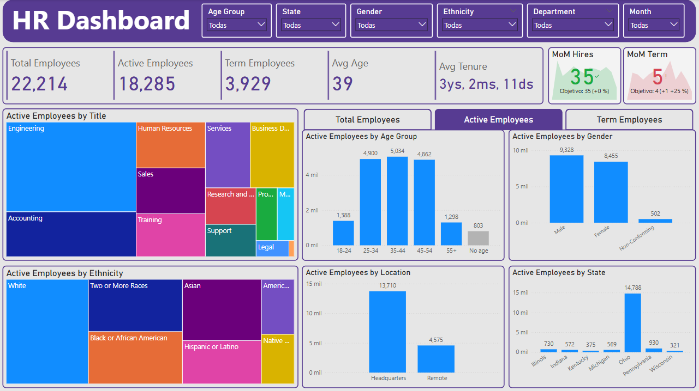

# MySQL & Power BI Project: HR Dashboard | See full DASHBOARD here: [App Power BI Link](https://app.powerbi.com/reportEmbed?reportId=a2dbd107-8117-4ecd-9c45-aa313c6d0d5f&autoAuth=true&ctid=616855e8-4a81-40b0-9bb9-10afe4e00966)

## About the project
This dashboard is meant to create visibility for a made up Chocolate retail company called Chocolate Awesome around its transaction data: revenue, cost, quantity sold, etc. With it the manager can have visibility over the companies performance across all the countries they ship to, the products they sell, the people that work in the company and generaly the status of the company across any given point in time.

### The development of this project included
Data import, Power Query, Data modeling, DAX, Data visualization and Power BI Service.

### The development of the dashboard included
Dashboard design, time intelligence, KPI cards, reference labels, conditional formatting, tooltips, field paramaters, bookmarks, dynamic trends, grouping, histograms, zoom sliders, table design and alert icons. 

## Steps
- Load all data tables from the xlsx file into Power Query using the xlsx connector
- Perform data transformations to the data to have it ready for the modeling phase
- Create relationships in the model view
- Build DAX measures to feed the data objects
- Design the dashboards layout to have a blueprint
- Create the dashboard
- Add more elements like: buttons, bookmarks, slicers, etc
- Publish the dashboard in Power BI Service

